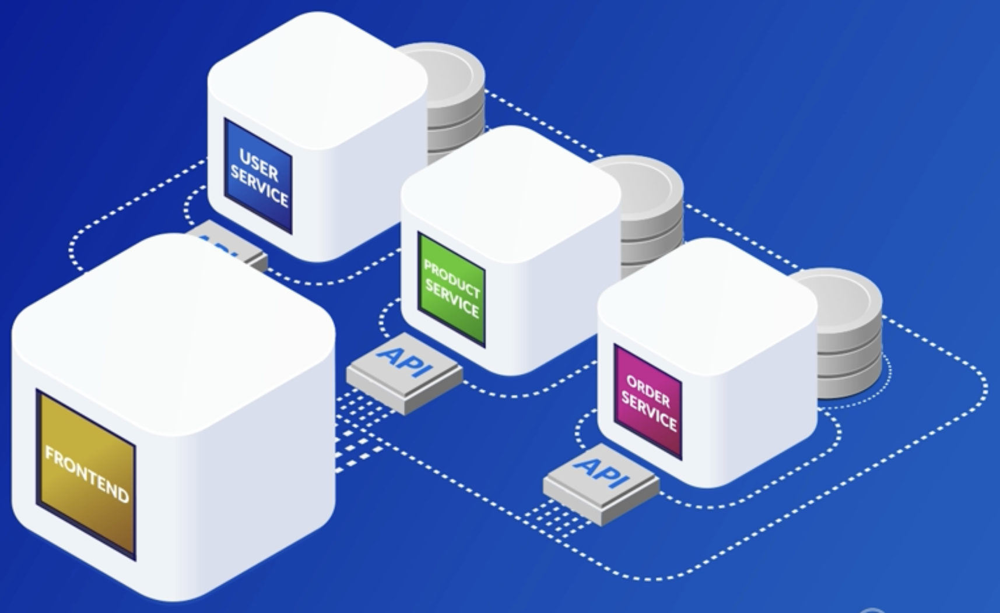

# Microservices
Basic implementation of microservices using Python , Flask and Docker.
The purpose of this repo is only demonstrate the concept of  microservices using python and how to microservices communicate each others.

Used Flask as web framework to demonstrate the microservices. Havn't used any databases.

Microservices:
   
    UserServices :-  Handles all user realted activity like login/logout and authoriazation etc.
    ProductServcies: Handles product related requests like getting all products deatils or query specific product.
    OrderServices: handles Order related stuff like placing and creating order.
    FrontendServices : This handles all frontend related stuff or interacting with end user.
    
    
    
 
